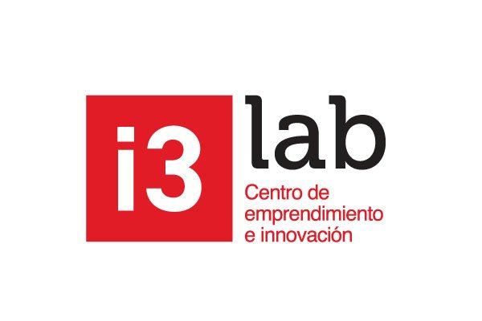
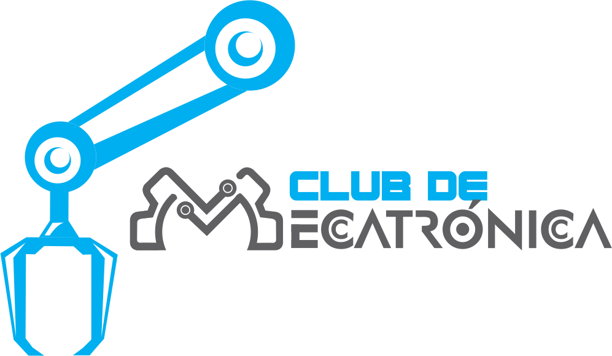
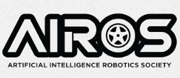

# Escape Room: Laboratorio Autónomo

## 🧠 Resumen de Juegos

### 1. 🔌 **Panel de Conexiones**
**Objetivo**: Conectar correctamente pares de conectores (colores, símbolos o números) usando cables tipo pinza.  
**Tecnología**: Arduino detecta conexiones correctas mediante pines digitales.  
**Desbloqueo**: Enciende un LED o buzzer al conectar todos los pares correctos.  
**Habilidad requerida**: Asociación visual y lógica básica.

  

---

### 2. 🧲 **Puerta Magnética**
**Objetivo**: Encontrar y usar un imán para activar un sensor magnético oculto (reed switch).  
**Tecnología**: El reed switch cierra el circuito, Arduino activa un servo motor que abre una compuerta secreta.  
**Desbloqueo**: Movimiento del servo, LED o sonido indicando éxito.  
**Habilidad requerida**: Exploración, intuición y prueba-error.

  

---

### 3. 🔺 **Simón Dice (9 LEDs y 9 Botones)**
**Objetivo**: Memorizar y repetir una secuencia aleatoria de luces usando 9 botones.  
**Tecnología**: Arduino genera y verifica secuencia; feedback con LEDs y buzzer.  
**Desbloqueo**: Acertar la secuencia completa activa un efecto visual o libera una pista.  
**Habilidad requerida**: Memoria, concentración y coordinación.

  

---

## 🎮 **Contexto de la Fase IOT**

**Contexto**: Esta es la fase final de confrontación. La IA, ya completamente arrogante, podría estar riéndose constantemente mientras los jugadores luchan con los dispositivos. La IA podría decir cosas como:  
- *"Veamos si su tan aclamado 'ingenio' puede con esto"*  
- *"Tic-tac, el tiempo se agota, ¿o es que la humanidad ya no tiene tiempo que perder?"*

### **Mecánica**
1. **Simón Dice** (tipo Among Us):  
   Los jugadores deben replicar una secuencia de luces en un panel de 9 LEDs, con la IA "saboteando" o cambiando la secuencia si se equivocan.

2. **Puerta Magnética**:  
   Los jugadores deben resolver un puzzle en paralelo activando sensores en diferentes puntos del laboratorio para desmagnetizar la puerta.

3. **Panel de Conexiones**:  
   Un puzzle de lógica donde deben conectar cables en el orden correcto para energizar un dispositivo, con indicaciones crípticas de la IA.

---

## Imágenes del Evento

### i3 Labs Logo

  

### Club mecatrónica Club Logo

  

### AIROS Club Logo

  

---

## 🚀 **Tecnologías y Herramientas Usadas**
- **Arduino** para la integración de sensores y motores.
- **LEDs y botones** para interacción con los jugadores.
- **Servo motor** para la puerta magnética.
- **Reed switch** para detectar cambios magnéticos.
- **Buzzer** para notificaciones de aciertos o fallos.

---
